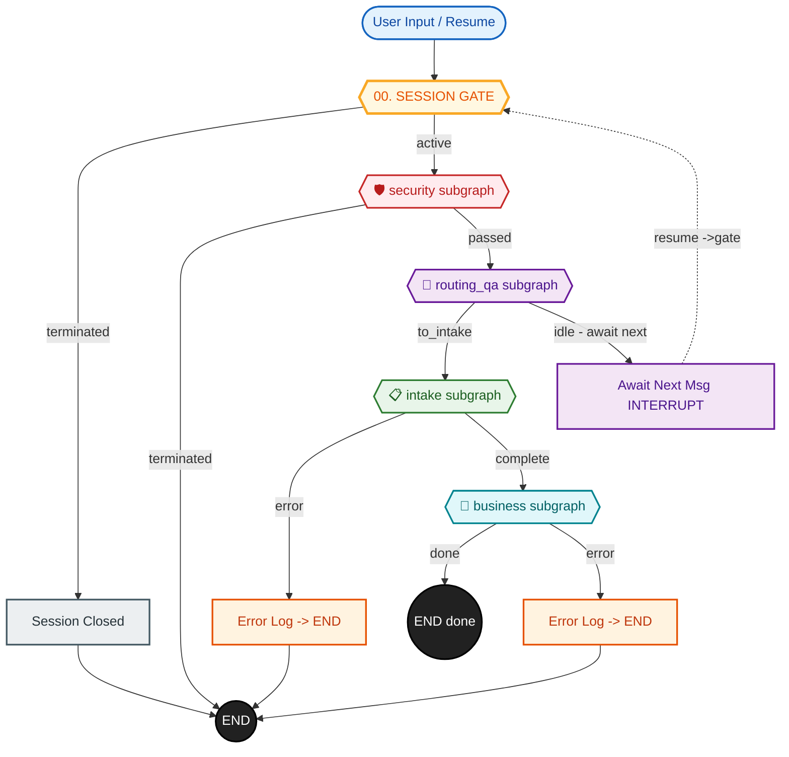

```mermaid
flowchart TD
    UserInput([User Input / Resume]):::entry --> Gate
    Gate{{00. SESSION GATE}}:::gate
    Gate -->|terminated| SessionClosed[Session Closed]:::terminal --> ENDx((END)):::endnode
    Gate -->|active| Security

    Security{{"🛡️ security subgraph"}}:::security
    Security -->|terminated| ENDx
    Security -->|passed| RouterQA

    RouterQA{{"💬 routing_qa subgraph"}}:::routing
    RouterQA -->|to_intake| Intake
    RouterQA -->|idle - await next| AwaitNext[Await Next Msg INTERRUPT]:::routing
    AwaitNext -.->|resume ->gate| Gate

    Intake{{"📋 intake subgraph"}}:::intake
    Intake -->|error| IntakeError[Error Log -> END]:::error --> ENDx
    Intake -->|complete| Business

    Business{{"💼 business subgraph"}}:::business
    Business -->|done| ENDdone((END done)):::endnode
    Business -->|error| BizError[Error Log -> END]:::error --> ENDx

    classDef entry fill:#e3f2fd,stroke:#1565c0,stroke-width:2px,color:#0d47a1;
    classDef gate fill:#fff8e1,stroke:#f9a825,stroke-width:3px,color:#e65100;
    classDef security fill:#ffebee,stroke:#c62828,stroke-width:2px,color:#b71c1c;
    classDef routing fill:#f3e5f5,stroke:#6a1b9a,stroke-width:2px,color:#4a148c;
    classDef intake fill:#e8f5e9,stroke:#2e7d32,stroke-width:2px,color:#1b5e20;
    classDef business fill:#e0f7fa,stroke:#00838f,stroke-width:2px,color:#006064;
    classDef error fill:#fff3e0,stroke:#e65100,stroke-width:2px,color:#bf360c;
    classDef terminal fill:#eceff1,stroke:#455a64,stroke-width:2px,color:#263238;
    classDef endnode fill:#212121,stroke:#000,stroke-width:2px,color:#fff;
```