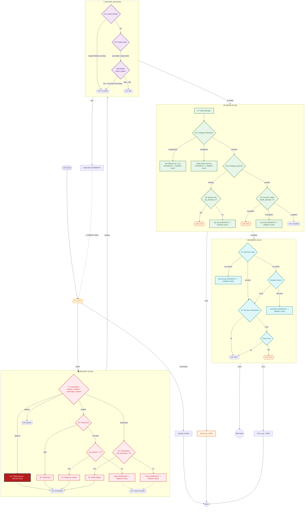

```mermaid
flowchart TD

    UserInput([User Input]) --> Gate{{00. GATE}}:::gate
    Gate -->|terminated| SC[Session Closed] --> ENDx((END))
    Gate -->|active| SEC

    subgraph SEC ["🛡️ SECURITY (01-05)"]
        direction TB
        Mod{"01. Moderation<br/>injection / violates / outofscope / passed"}:::security
        Mod -->|injection| TermInj["05. TERM injection - INSTANT BAN"]:::injection
        Mod -->|violates| Threat{"02. Threat Eval"}:::security
        Mod -->|outofscope| Soft{"03. Soft Redirect<br/>soft_warnings++ >3?"}:::security
        Threat -->|fatal| TermFatal["05. TERM fatal"]:::security
        Threat -->|non-fatal| SecStrike{"sec_strikes++ >3?"}:::security
        SecStrike -->|yes| TermSec["05. TERM sec strikes"]:::security
        SecStrike -->|no| SecWarn["Warn INTERRUPT -> PARENT GATE"]:::security
        Soft -->|yes| TermBan["05. TERM offtopic"]:::security
        Soft -->|no| SoftPivot["Pivot INTERRUPT -> PARENT GATE"]:::security
        TermInj & TermFatal & TermSec & TermBan --> SEC_END{{exit: terminated}}
        SecWarn & SoftPivot -.-> SEC_RESUME{{exit: resume to gate}}
        Mod -->|passed| SEC_PASS{{exit: passed}}
    end

    SEC -->|passed| RQA

    subgraph RQA ["💬 ROUTING_QA (04,06)"]
        direction TB
        Router{"04. Context Router"}:::routing
        Router -->|request-details / pivoting| RQA_TO_INTAKE{{exit: to_intake}}
        Router -->|qa| QA{"06. Product Q&A"}:::routing
        QA -->|grounded / ungrounded| QAJoin{"Q&A Rejoin<br/>active_intake?"}:::routing
        QAJoin -->|true - drop back into intake| RQA_TO_INTAKE
        QAJoin -->|false - idle| RQA_IDLE{{exit: idle}}
    end

    RQA -->|idle| Await[Await Next INTERRUPT] -.->|-> PARENT GATE| Gate
    RQA -->|to_intake| INTAKE

    subgraph INTAKE ["📋 INTAKE (07-09)"]
        direction TB
        SM["07. State Manager"]:::intake --> Cat{"07b. Category Resolution"}:::intake
        Cat -->|unsupported| CatUn["Not Offered Yet + List INTERRUPT -> PARENT GATE"]:::intake
        Cat -->|ambiguous| CatCl["Clarify Which Service INTERRUPT -> PARENT GATE"]:::intake
        Cat -->|resolved| Check{"Zip & Category present?"}:::intake
        Check -->|missing| Zip{"08. Request Zip<br/>zip_attempts >3?"}:::intake
        Zip -->|yes| ZipErr{{exit: error}}:::error
        Zip -->|no| ZipInt["Ask Zip INTERRUPT -> PARENT GATE"]:::intake
        Check -->|present| Dyn{"09. Dynamic Intake<br/>intake_attempts >3?"}:::intake
        Dyn -->|exceeded| DynErr{{exit: error}}:::error
        Dyn -->|incomplete| DynInt["Ask Slot INTERRUPT -> PARENT GATE"]:::intake
        Dyn -->|complete| INTAKE_OK{{exit: complete}}
    end

    INTAKE -->|error| Err1[Error Log -> END]:::error --> ENDx
    INTAKE -->|complete| BIZ

    subgraph BIZ ["💼 BUSINESS (10-11)"]
        direction TB
        Logic{"10. Business Logic"}:::business -->|no_service| NotServ["Not Served INTERRUPT -> PARENT GATE"]:::business
        Logic -->|no_match| Broaden{"Broaden Search"}:::business
        Logic -->|success| Tool{"11. Tool Exec idempotent"}:::business
        Broaden -->|found| Tool
        Broaden -->|still none| NoMatch["No Match INTERRUPT -> PARENT GATE"]:::business
        Tool -->|ok| BIZ_OK{{exit: done}}
        Tool -->|error| Retry{"Retry once"}:::business -->|ok| BIZ_OK
        Retry -->|fail| ToolErr{{exit: error}}:::error
    end

    BIZ -->|done| ENDdone((END done))
    BIZ -->|error| Err2[Error Log -> END] --> ENDx

    classDef entry fill:#e3f2fd,stroke:#1565c0,stroke-width:2px,color:#0d47a1;
    classDef gate fill:#fff8e1,stroke:#f9a825,stroke-width:3px,color:#e65100;
    classDef security fill:#ffebee,stroke:#c62828,stroke-width:2px,color:#b71c1c;
    classDef injection fill:#b71c1c,stroke:#000,stroke-width:3px,color:#fff;
    classDef routing fill:#f3e5f5,stroke:#6a1b9a,stroke-width:2px,color:#4a148c;
    classDef intake fill:#e8f5e9,stroke:#2e7d32,stroke-width:2px,color:#1b5e20;
    classDef business fill:#e0f7fa,stroke:#00838f,stroke-width:2px,color:#006064;
    classDef error fill:#fff3e0,stroke:#e65100,stroke-width:2px,color:#bf360c;
    classDef terminal fill:#eceff1,stroke:#455a64,stroke-width:2px,color:#263238;
    classDef endnode fill:#212121,stroke:#000,stroke-width:2px,color:#fff;
```